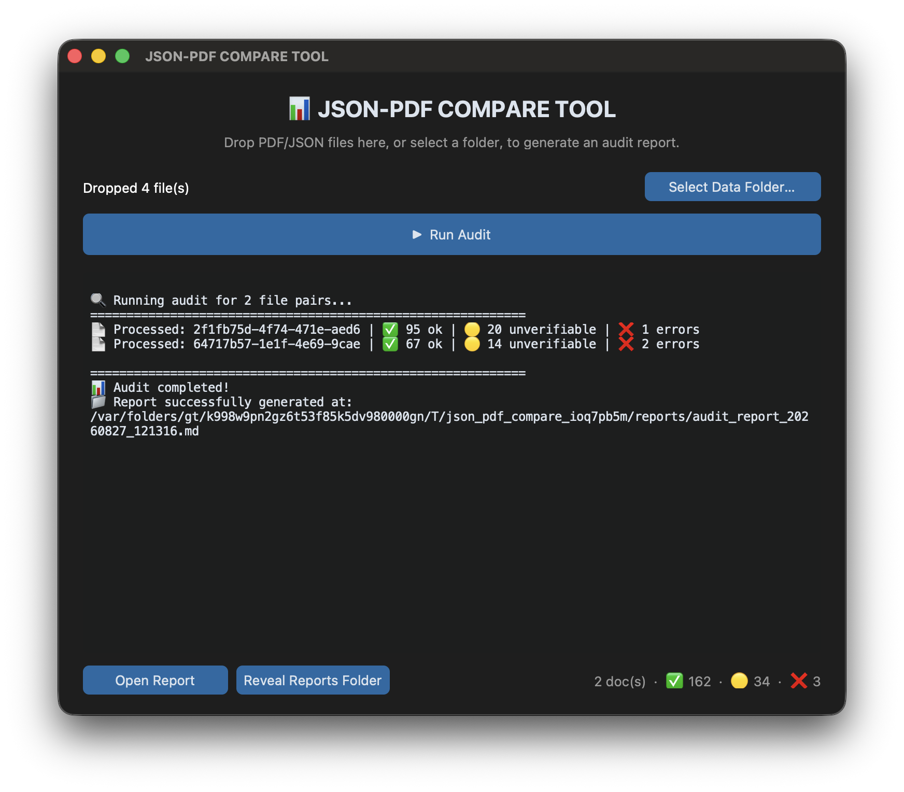

# JSON-PDF Compare Tool

An automated auditing tool to ingest, validate, and compare different administration document pairs (PDF vs. JSON) for fiscal compliance.

---

## 📋 Features

* **Batch File Pairing:** Automatically matches `.pdf` and `.json` files recursively across directories by base filename, ignoring each file's trailing 13-character system-generated suffix (e.g. `..._W2IWIZ2W_DBS.pdf` / `..._W2IWIZ9C_4US.json`) — so you can drop many document pairs into `./data` at once without renaming anything. If two files would resolve to the same base name, the tool warns instead of silently dropping one.
* **Smart Verification:** Checks JSON key-value pairs against PDF text content, supporting European numeric formats (`1.166,34`), standard floats (`1.166.34`), and ISO dates (`YYYY-MM-DD` to `DD/MM/YYYY`). Matching is case-insensitive and tolerant of line wraps/whitespace differences between the PDF and JSON, and a word-order-independent fallback catches fields a PDF splits differently than the JSON (e.g. a full name stored as one JSON field but printed as separate "Cognome" / "Nome" lines).
* **Three-Tier Audit Outcome:** Each JSON field is reported as a **Match** (confidently verified), a **Discrepancy** (no trace of the value found anywhere in the PDF — the strongest signal of a real data problem), or **Unverifiable** (a weak/coincidental textual trace was found, but not enough to confirm — worth a quick manual look rather than treating it as pass or fail).
* **Markdown Audit Reports:** Automatically generates detailed execution reports with executive summaries and field-level match/unverifiable/discrepancy breakdowns.
* **Desktop App:** A `customtkinter` GUI (`auditor_gui.py`) drives the same audit engine — pick a folder, click *Run Audit*, and view results.

---

## ⚙️ Prerequisites

* **Python:** `3.9` or higher

---

## 🚀 Installation & Setup

1. **Clone the repository:**
````Bash
git clone [https://github.com/octavirodriguez/json_pdf_compare_tool.git](https://github.com/octavirodriguez/json_pdf_compare_tool.git)
cd json_pdf_compare_tool
````
2. **Create and activate a Virtual Environment:**
````Bash
python3 -m venv venv
source venv/bin/activate
````
3. **Install dependencies:**
````Bash
pip install -r requirements.txt
````

---

## 🖥️ Desktop App
<div align="center">

</div>

🍏 Mac Users: If the application crashes on launch or shows an error, it is due to macOS Gatekeeper. Please follow the quick steps in our [macOS Troubleshooting Guide](docs/run-on-macos.md) to trust the app locally

Prefer a GUI over the command line? Run:
````Bash
python auditor_gui.py
````
Pick a data folder, click **Run Audit**, then use **Open Report** or **Reveal
Reports Folder** to see the results. It uses the exact same audit engine as
the CLI (`auditor.py`) — nothing about the matching or report logic differs.

You can also drop PDF and JSON files directly onto the app window. Dropped
files are staged temporarily, normalized into a pair, audited immediately, and
left in their original location unchanged. Drop one pair at a time when the
filenames are unrelated.

---

## 💻 CLI Usage

1. Place your PDF and JSON file pairs into the `./data` folder (subdirectories are supported). You can drop in a whole batch at once — files are paired by base filename once each one's trailing 13-character suffix is stripped, so `.pdf` and `.json` files don't need identical names.

   > ⚠️ `./data` is git-ignored on purpose, since these are typically real fiscal/personal documents. Never remove `data/` from `.gitignore` or force-add files from it.

2. Run the audit script:
   ````Bash
   python auditor.py
   ````
   
   Optional: You can also specify a custom input directory:
   python auditor.py ./path/to/custom_folder

3. View the generated Markdown report inside the `./reports` directory (`audit_report_YYYYMMDD_HHMMSS.md`). Each document is scored ✅ OK (all fields matched), 🟡 NEEDS REVIEW (no discrepancies, but some fields were unverifiable), or ❌ ISSUES FOUND (at least one discrepancy).

## 📥 Optional macOS Folder Action
<div align="center">

</div>

When incoming PDF and JSON files have unrelated names, place one pair at a time
directly in your Desktop hot folder. The included `rename_json_to_pdf.py` script
renames the JSON to the PDF's basename while preserving the `.json` extension:

```text
JSON-PDF Hot Folder/
├── official_document.pdf
└── export_abc.json
```

The pair is then moved automatically to this repository's `data/` folder:

```text
data/
├── official_document.pdf
└── official_document.json
```

The script changes the hot folder only when it contains exactly one PDF and one
JSON, then moves the renamed pair to `data/`. It never overwrites an existing
file. Process one pair at a time so unrelated files cannot be confused. To use
it as a macOS Folder Action,
create a Folder Action in Automator, add **Run Shell Script**, choose **Pass
input: as arguments**, and run:

```bash
/path/to/json_pdf_compare_tool/venv/bin/python3 \
   /path/to/json_pdf_compare_tool/rename_json_to_pdf.py "$@"
```

The folder action may run when either file arrives; it safely does nothing until
both files are present.

## 📁 Repository Structure
```text
json_pdf_compare_tool/
├── data/              # Input directory for PDF/JSON pairs (git-ignored — may hold real personal data)
├── reports/           # Generated Markdown audit reports (git-ignored)
├── venv/              # Python virtual environment (git-ignored)
├── tests/             # pytest unit tests
├── auditor.py         # Core auditing engine
├── auditor_gui.py     # customtkinter desktop GUI, built on auditor.py
├── rename_json_to_pdf.py # Optional macOS Folder Action helper
├── profiles/           # Model-specific audit rules
│   ├── base.py         # Profile interface
│   └── urssaf_autoentrepreneur.py # URSSAF rules
├── docs/               # Usage and maintainer documentation
│   ├── HOW_IT_WORKS.md
│   ├── buildApp.md
│   └── run-on-macos.md
├── img/                # README screenshots
│   ├── autom.png
│   └── gui.png
├── requirements.txt  # Runtime dependencies
├── setup.py            # macOS app packaging configuration
├── readme.md          # Project documentation
├── LICENSE             # MIT license
└── .gitignore         # Git ignore rules
```
---

## 🔬 Running the Tests

```bash
pytest tests/
```

The suite covers matching logic, numeric/date/name variants, the three-tier classification, PDF read error handling, and file-pairing edge cases.

---

## 🤝 Contributing

Contributions are welcome! Please feel free to open an issue or submit a Pull Request.

---

## 📄 License

This project is licensed under the MIT License - see the LICENSE file for details.
